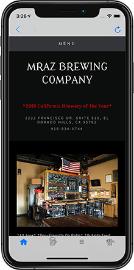
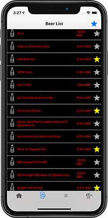
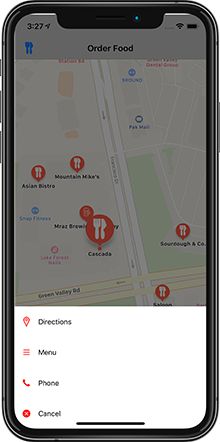
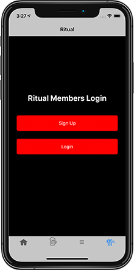

# Mraz

 
## Description:
Mraz Brewery is located in El Dorado Hills, CA and brews delicious beer. I developed this application in conjunction with the brewery to enhance the user experience at the brewery. Since they have different beers on tap all the time there is a list of all beers provided by the brewery where users can tap on a star to 'favorite' the beer or beers that they enjoy. This way you can remember when one of your favorite beers are on tap! There is a also a screen that shows a Map with restaurants local to the brewery that enables users to select a restaurant and get the website, phone numer and directions to that location. 

***
## Technologies: 
* **UICollectionView:** CollectionView used to display a list of beers brewed by the brewery and sold in the tasting room. 
* **UITabBarController:** Application is built on UITabBarController to display the different screens (WebView, Beers, Restaurants Map). 
* **Core Data:** Core Data used for local persistence. This is used to save your favorite beers that the user has selected on the beers screen.
* **CloudKit:** Used NSPersistentCloudKitContainer to perform Core Data/CloudKit Sync. This will save the beer you have selected as a favorite and make this data available on all your iOS devices!
* **Firebase:** Firebase is used for Push Notifications to be sent to users by the brewery regarding events at the brewery.
* **WebKit:** WebKit is used to provide access to the brewery's website right from the application. Used customized buttons for the webview so you can navigate the website without leaving the application.
* **MapKit:** MapKit used to display restaurants close by the brewery and provides the restaurants website, phone number, and directions to the restaurant. 
* **Local Notifications:**
* **Push Notifications:** Push Notifications are used for Geofencing (see below), as well as through Firebase when sending a message out to all users regarding brewery news.
* **Geofencing:** Users that have the application downloaded will get a local notification within a half-mile of the brewery suggesting that they come inside for a beer!
* **Programatic UI:** Built the UI programatically without the use of Xib's or Storyboards.

***
## About This Project: 
- **Why did I make Mraz?** I wanted to make an application for a brewery that I frequented. They did not have an application and I wanted to make them something great that they would love. As I was thinking about the application I would get to use some new frameworks that I didn't have a lot of experience using (CLLocation, MapKit, WebKit).   

- **What have I learned so far?** With the first round of this app it was put together a little to quickly to get in front of the client. Next time I would take a little more time developing it so I don't have to go back and refactor so much of the code!
  * I used new frameworks CLLocation for geofencing, as well as WebKit and MapKit. I had a lot of fun getting into these framworks and getting to learn something new. 
  * I used programatic UI that helped me conform to MVC. 
  * I
- **Whats Next?** 
  * Revising the code as the first round was to get the concept in front of the client to see what they liked/didn't like. 
  * Some UI Improvements and updates for iOS 13.

***
## Screenshots:
  

***
## Requirements:
* iOS 13.0+
* Xcode 10+
***
## About The Developer:
I am an iOS Developer from Northern CA. I focus on writing applications in Swift and Objective-C. To learn more about me, you can check out my [portfolio](https://dylanmccarthyios.com).
***

